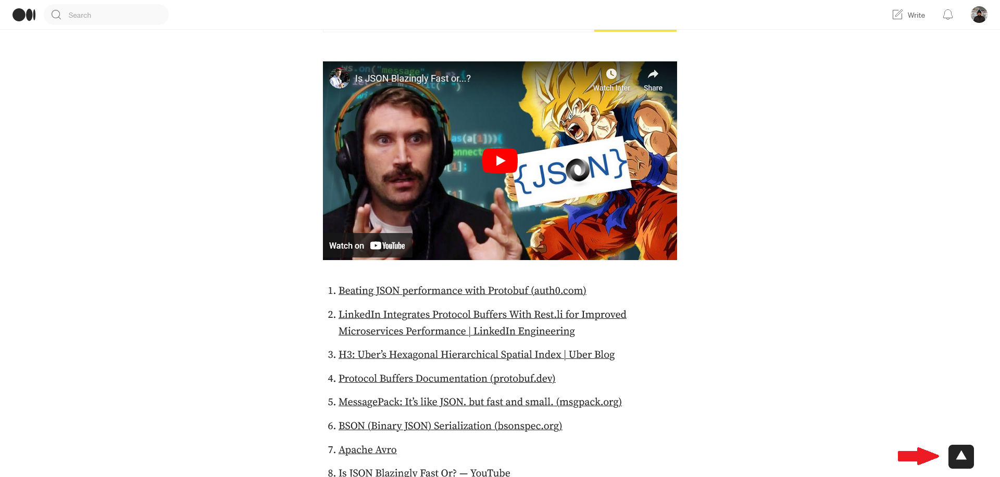

  

<h1 align="center">Medium Scroll-to-top</h1>

*It was annoying & time consuming for me to scroll to top repetitively. Therefore, this extension was born.*

## Installation Instructions
### Google Chrome / Microsoft Edge / Chromium Browsers (Brave/Opera Mini) (Custom sites supported) 
 

 

Or install manually
1. Download this repo as a [ZIP file from GitHub](https://github.com/Xatta-Trone/medium-scroll-to-top/archive/refs/heads/main.zip).
1. Unzip the file and you should have a folder named `medium-scroll-to-top-main`.
1. In Chrome/Edge go to the extensions page (`chrome://extensions` or `edge://extensions`).
1. Enable Developer Mode by clicking the toggle button on the top right side of the browser.
1. Drag the `medium-scroll-to-top-main` folder anywhere on the page to import it (do not delete the folder afterward).

### Mozilla Firefox (Custom sites not supported) 
 

 

## Preview

  

### Updates

### 1.0.0
First release
